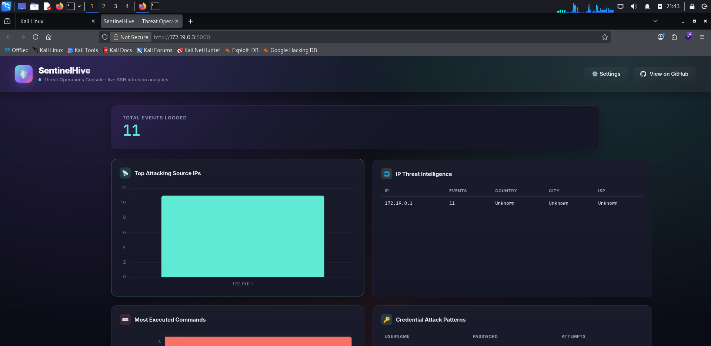
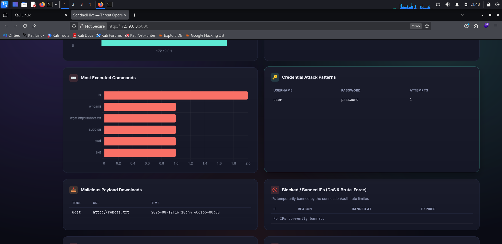
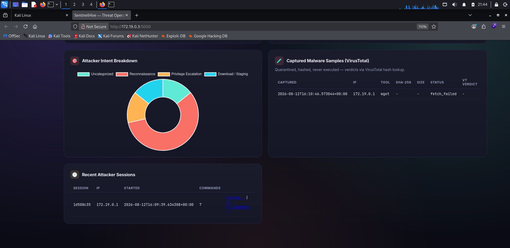
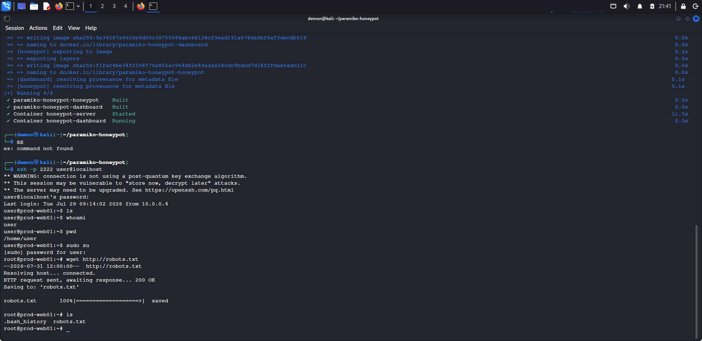
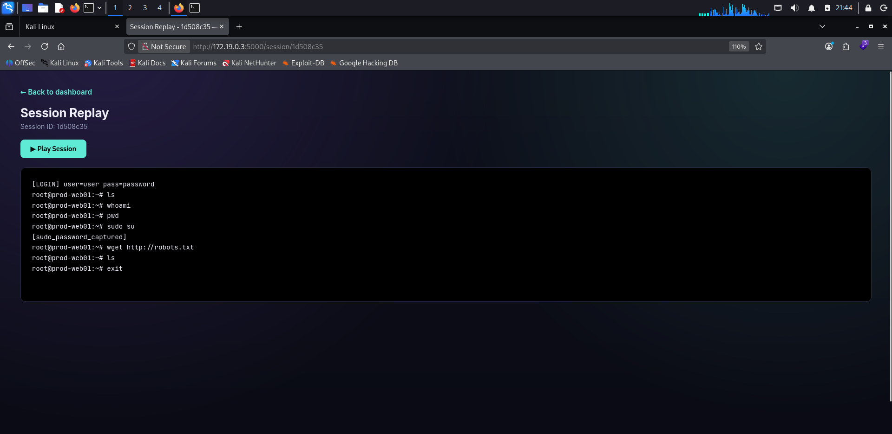
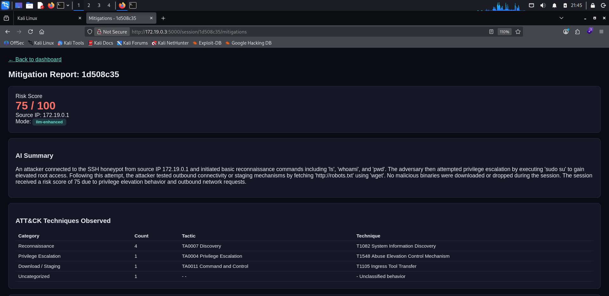
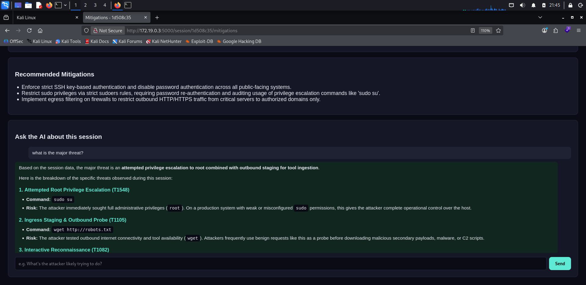
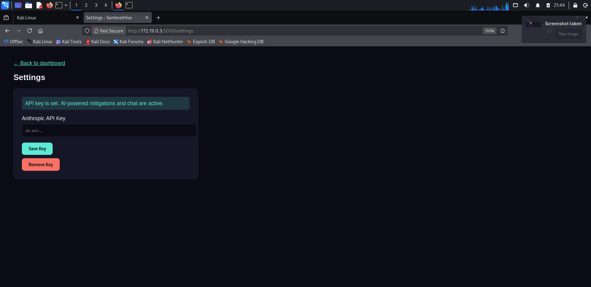

# Paramiko SSH Honeypot

A fully custom-built SSH honeypot written from scratch in Python, inspired by the design ideas behind [Cowrie](https://github.com/cowrie/cowrie). It fakes an entire Linux server — login, shell, filesystem, and common attacker tools — while logging every move an attacker makes, classifying their intent against the MITRE ATT&CK framework, capturing any malware they try to deploy, and alerting in real time.

> ⚠️ **WARNING:** Run this only on an isolated VM/server you control (VirtualBox, cloud VM, etc.) — never on your personal machine or trusted network. It intentionally accepts fake logins from anyone who connects.

---

## What it does

- Accepts SSH connections and logs every username/password combo tried, then lets the attacker "in"
- Drops them into a fake shell backed by a real in-memory virtual filesystem (`ls`, `cd`, `cat`, `pwd` all work convincingly)
- Supports extended commands: `whoami`, `uname`, `ps`, `ifconfig`, `netstat`, `history`, `touch`, `mkdir`, `rm`, `sudo`
- Fakes `wget`/`curl` — logs the URL, and actually fetches the file in the background (size-capped, timeout-bounded) to capture real malware samples
- Every captured sample is hashed (SHA256), quarantined read-only, and checked against VirusTotal — never executed
- Classifies every command into an intent category (Reconnaissance, Persistence, Privilege Escalation, etc.) and maps it to a real MITRE ATT&CK tactic/technique ID
- Looks up attacker IPs for geolocation/ISP via a free threat-intel API
- Groups commands into sessions and lets you replay a full attacker session like a terminal recording
- A live Flask dashboard visualizes all of the above with charts
- AI mitigation advisor (Google Gemini) generates tailored incident summaries and remediation steps per session, with a live follow-up chat
- Sends real-time Telegram alerts for logins, privilege escalation attempts, and downloads
- DoS/brute-force protection with automatic temporary IP bans
- Fully containerized with Docker Compose — one command to run the whole stack

## Why build this instead of just deploying Cowrie?

Cowrie is a mature, production-grade honeypot — great to run for real threat intel. This project is a smaller, self-built version of the same idea, meant to demonstrate understanding of the SSH protocol, socket programming, SQLite, Flask, Docker, and security concepts (MITRE ATT&CK, malware handling, threat intel) from the ground up.

---

## Screenshots

**Dashboard overview**




**Attacker session in a real terminal**


**Session replay**


**AI mitigation advisor**



**Settings (API key setup)**


---

## Project status — all milestones complete

- [x] Milestone 1 — Project scaffold
- [x] Milestone 2 — Fake SSH server, logs auth attempts + basic commands
- [x] Milestone 3 — Virtual filesystem + real command interpreter (ls, cd, cat...)
- [x] Milestone 4 — Extended commands + fake file downloads (wget/curl)
- [x] Milestone 5 — Persistent SQLite logging
- [x] Milestone 6 — Flask web dashboard (charts for top IPs/commands/credentials)
- [x] Milestone 7 — Threat intelligence API (IP geolocation/ISP lookups, cached)
- [x] Milestone 8 — Session tracking + terminal-style session replay
- [x] Milestone 9 — Rule-based command intent classifier
- [x] Milestone 10 — MITRE ATT&CK tactic/technique mapping
- [x] Milestone 11 — Real malware capture: SHA256 hashing, read-only quarantine, VirusTotal verdicts
- [x] Milestone 12 — Docker Compose deployment
- [x] Milestone 13 — Real-time Telegram alerts
- [x] Milestone 14 — Multi-user accounts, per-user home directories, expanded commands
- [x] Milestone 15 — DoS/brute-force protection: connection and auth-attempt rate limiting with automatic temporary IP bans
- [x] Milestone 16 — AI mitigation advisor: session findings analyzed by Google Gemini to generate tailored incident summaries and remediation steps (rule-based fallback when no API key is set)
- [x] Milestone 17 — Live AI chat on the mitigations page for asking follow-up questions about a session

---

## Project structure

```
paramiko-honeypot/
  server.py              Core SSH honeypot (paramiko-based)
  fake_fs.py             In-memory virtual filesystem
  db.py                  SQLite persistence and analytics queries
  analyzer.py            Command intent classifier
  attck_mapping.py       MITRE ATT&CK tactic/technique mapping
  threat_intel.py        IP geolocation/ISP lookups (cached)
  malware_capture.py     Real file capture, hashing, quarantine
  vt_lookup.py           VirusTotal hash-reputation lookups
  telegram_alerts.py     Real-time Telegram notifications
  dashboard.py           Flask web dashboard
  rate_limiter.py        DoS/brute-force connection & auth rate limiting
  mitigation_advisor.py  AI mitigation advisor (Gemini) + session chat
  requirements.txt
  Dockerfile
  docker-compose.yml
  .env.example           Template for required environment variables
  .env                   Your actual API keys — never committed
  logs/ , keys/ , quarantine/   Runtime data — never committed
```

---

## Getting Started

### Prerequisites

- Python 3.10 or newer
- `pip` (comes with Python)
- Git
- Docker + Docker Compose (only needed for the Docker setup path)
- A free [VirusTotal](https://www.virustotal.com) account — optional, enables malware hash verdicts
- A Telegram bot token — optional, enables real-time alerts
- A [Google Gemini API key](https://aistudio.google.com/apikey) — optional, enables the AI mitigation advisor

> None of the optional keys are required to run the honeypot. Every feature that depends on one has a safe fallback (rule-based analysis, no alerts sent, etc.) if the key is missing.

---

### Option A: Run locally (no Docker)

**1. Clone the repo**
```
git clone https://github.com/Shivaraj09122005/paramiko-honeypot.git
cd paramiko-honeypot
```

**2. Create and activate a virtual environment**
```
python3 -m venv venv
source venv/bin/activate
```
(On Windows: `venv\Scripts\activate`)

**3. Install dependencies**
```
pip install -r requirements.txt
```

**4. Set up your environment file**
```
cp .env.example .env
```
Open `.env` in any editor and fill in whichever keys you have (VirusTotal, Telegram, Gemini). Leave the rest blank.

**5. Start the honeypot server**
```
python server.py
```
Listens on port `2222` by default.

**6. In a new terminal, start the dashboard**
```
source venv/bin/activate
python dashboard.py
```
Visit **http://localhost:5000** in your browser.

**7. Test it**

In a third terminal:
```
ssh -p 2222 anyuser@localhost
```
Any username/password will be "accepted" into a fake shell. Check the dashboard — the session should appear live.

---

### Option B: Run with Docker (recommended)

The entire stack (honeypot + dashboard) runs as two containers sharing persistent volumes for logs, keys, and quarantined samples.

**1. Clone the repo**
```
git clone https://github.com/Shivaraj09122005/paramiko-honeypot.git
cd paramiko-honeypot
```

**2. Create your `.env` file**
```
echo "VT_API_KEY=your_virustotal_key_here" > .env
echo "TELEGRAM_BOT_TOKEN=your_bot_token_here" >> .env
echo "TELEGRAM_CHAT_ID=your_chat_id_here" >> .env
echo "GEMINI_API_KEY=your_gemini_key_here" >> .env
```
Skip any line for a service you're not using.

**3. Build and start the containers**
```
docker compose build
docker compose up -d
```

**4. Confirm both containers are running**
```
docker compose ps
```

**5. Test it**
```
ssh -p 2222 anyuser@localhost
```
Then open **http://localhost:5000** for the dashboard.

**6. View logs**
```
docker compose logs -f
```

**7. Stop everything**
```
docker compose down
```

---

### Real-world deployment note

If deploying on a real cloud server, do **NOT** expose the dashboard (port 5000) directly to the internet — it shows attacker IPs, tried credentials, and captured malware hashes. Instead, access it through an SSH tunnel:

```
ssh -L 5000:localhost:5000 youruser@your-server-ip
```

Then open `http://localhost:5000` in your own browser — nothing is exposed publicly.

---

## Getting API keys

| Service | Used for | How to get it |
|---|---|---|
| VirusTotal | Verifying captured malware hashes | Sign up free at [virustotal.com](https://www.virustotal.com) → Profile → API Key |
| Telegram Bot | Real-time login/download alerts | Message [@BotFather](https://t.me/BotFather) → `/newbot` → copy the token. Get your chat ID from [@userinfobot](https://t.me/userinfobot) |
| Google Gemini | AI mitigation advisor & session chat | Go to [Google AI Studio](https://aistudio.google.com/apikey) → Create API key |

---

## Troubleshooting

**"Address already in use" on port 2222 or 5000**
Something else is using the port. Stop that process, or change the port in `server.py` / `dashboard.py`.

**SSH client refuses to connect / host key errors**
```
ssh-keygen -R "[localhost]:2222"
```
Then retry the connection.

**Dashboard shows no data**
Make sure `server.py` is running and you've connected at least once via `ssh -p 2222 anyuser@localhost`.

**Docker containers exit immediately**
```
docker compose logs
```
Check the output for the actual error.

**Gemini / VirusTotal / Telegram features not working**
Confirm the relevant key is set correctly in `.env`, and restart the server/containers after editing it — environment variables are only read on startup.

**Permission denied on `logs/`, `keys/`, or `quarantine/`**
These folders are created automatically on first run. If you see permission errors under Docker, try:
```
sudo chown -R $USER:$USER logs keys quarantine
```

---

## Safety notes

- Every fake `wget`/`curl` fetch is size-capped (5MB) and timeout-bounded (8s)
- Captured files are renamed to their SHA256 hash, saved read-only, and never executed
- Investigate captured samples via hash reputation (VirusTotal) — never by opening them directly
- API keys are loaded from environment variables / `.env`, never hardcoded or committed to git

---

## Contributing

Issues and pull requests are welcome. If you're adding a new command, intent classification rule, or ATT&CK mapping, please include a brief description of what attacker behavior it covers.

---

## License

This project is for educational and defensive security research purposes.

